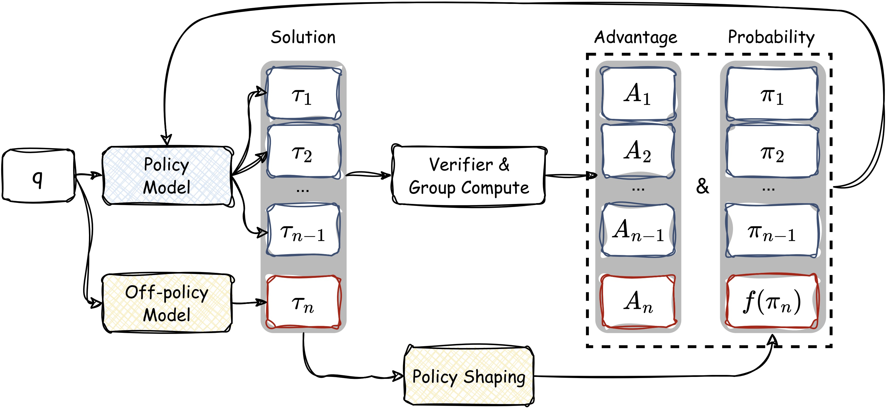
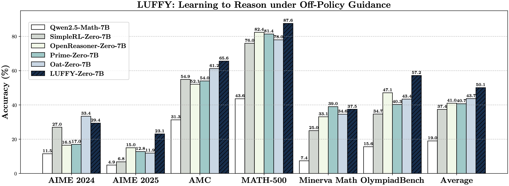

<div align="center">


<h1 style="display: flex; justify-content: center; align-items: center; gap: 10px; margin: 0;">
  
  LUFFY: Learning to Reason Under Off‑Policy Guidance
</h1>

<div align="center">
  
</div>


[](https://arxiv.org/abs/2502.xxxx)  [](https://github.com/ElliottYan/LUFFY)   [](https://huggingface.co/collections/Elliott/luffy-rl-6804e1f5d1ebe66ba8ac92f4)

<div align="center" style="font-family: Arial, sans-serif; font-size: 16px;">
  <p>
    <a href="#news" style="text-decoration: none; font-weight: bold;">🎉 News</a> •
    <a href="#links" style="text-decoration: none; font-weight: bold;">🔗 Links</a> •
    <a href="#getting-started" style="text-decoration: none; font-weight: bold;">✨ Getting Started</a> •
    <a href="#introduction" style="text-decoration: none; font-weight: bold;">📖 Introduction</a>
  </p>
  <p>
    <a href="#usage" style="text-decoration: none; font-weight: bold;">🔧 Usage</a> •
    <a href="#evaluation" style="text-decoration: none; font-weight: bold;">📃 Evaluation</a> •
    <a href="#citation" style="text-decoration: none; font-weight: bold;">🎈 Citation</a> •
    <a href="#acknowledgement" style="text-decoration: none; font-weight: bold;">🌻 Acknowledgement</a> •
    <!-- <a href="#star-history" style="text-decoration: none; font-weight: bold;">📈 Star History</a> -->
  </p>
</div>


</div>

---

# 🎉News

- **[2025/04/20]** The models and datasets are released on [HuggingFace](https://huggingface.co/collections/Elliott/luffy-rl-6804e1f5d1ebe66ba8ac92f4).
- **[2025/04/20]** LUFFY codebase is released along with evaluation scripts. Try it out!
- **[2025/04/20]** LUFFY paper available on [arXiv](https://arxiv.org/abs/2504.xxxxx). 

---

# 🔗Links

- 📜 [Paper (arXiv)](https://arxiv.org/abs/2504.xxxxx)  
- 🤗 [HuggingFace Collection](https://huggingface.co/collections/Elliott/luffy-rl-6804e1f5d1ebe66ba8ac92f4)

---

# ✨Getting Started

## Installation

You can install LUFFY dependencies by running the following commands:
```bash
conda create -n luffy python=3.10
conda activate luffy
pip install -r requirements.txt
pip install -e .
cd verl
pip install -e .
```

If you encounter issues when installing flash-attn, we recommend you to install it here 
[flash-attn](https://github.com/Dao-AILab/flash-attention/releases/tag/v2.7.3).

## Repo Structure

This repository includes:

- `luffy`: Codes for training LUFFY using off-policy reasoning traces. Our main code changes are in luffy/verl/verl/mix_src.
- `data`: Data and code for training and evaluating LUFFY. 
- `exp_scripts`: Example script to train LUFFY.
- `eval_scripts`: Evaluation scripts on math and out-of-distribution benchmarks.

LUFFY is built on top of the GRPO framework and supports plug-and-play integration with off-policy traces from models such as DeepSeek-R1.

---

# 📖Introduction

LUFFY is a reinforcement learning framework that bridges the gap between zero-RL and imitation learning by incorporating off-policy reasoning traces into the training process. Built upon GRPO, LUFFY combines on-policy rollouts with off-policy demonstrations during advantage estimation and introduces **policy shaping** via regularized importance sampling to emphasize low-probability yet crucial actions.



### Key Highlights:
- **Off-Policy Guidance:** Seamlessly integrates external reasoning traces to bootstrap learning from stronger models.
- **Dynamic Balance:** Learns when to imitate and when to explore, adapting over the course of training.
- **Policy Shaping:** Emphasizes important actions often ignored in standard policy gradients, enabling better generalization.

---


# 🔧Usage

## Data Preparation
You need to first run the data preparation script to get the training data in parquet format.
```bash
cd data
python prepare_train.py
```

## Training

We provide an example script to train LUFFY on our subset of OpenR1-Math-220k. You can run the following command to train LUFFY:

```bash
  bash exp_scripts/train.sh
```

## Inference

LUFFY supports both math and reasoning tasks. Here’s an example of using LUFFY for inference:

<details>
<summary>Click to view inference example</summary>

```python
from transformers import AutoTokenizer
from vllm import LLM, SamplingParams

model_path="Elliott/LUFFY-Qwen-Math-7B-Zero"

question = "which number is larger? 9.11 or 9.9?"

tokenizer = AutoTokenizer.from_pretrained(model_path)
messages = [{"role": "user", "content": question}]
chat = tokenizer.apply_chat_template(messages, tokenize=False, add_generation_prompt=True)

llm = LLM(model=model_path)
params = SamplingParams(temperature=0.6, max_tokens=8192)
outputs = llm.generate([chat], params)
print(outputs[0].outputs[0].text)
```

</details>

---

# 📃Evaluation

LUFFY is evaluated on six competition-level benchmarks, achieving state-of-the-art results among all zero-RL methods. It surpasses both on-policy RL and imitation learning (SFT), especially in generalization:


| **Model**                          | **AIME 2024** | **AIME 2025** | **AMC** | **MATH-500** | **Minerva** | **Olympiad** | **Avg.** |
|-----------------------------------|-------------|-------------|---------|---------------|-------------|---------------|----------|
| Qwen2.5-Math                      | 12.9        | 4.2         | 32.6    | 48.8          | 10.7        | 14.8          | 20.7     |
| Qwen2.5-Math-Instruct             | 11.4        | 8.8         | 48.3    | 81.2          | 33.1        | 38.8          | 36.9     |
| SimpleRL-Zero                     | 26.3        | 6.7         | 55.4    | 74.4          | 25.7        | 35.4          | 37.3     |
| OpenReasoner-Zero                 | 17.2        | 15.0        | 52.3    | 84.6          | 33.8        | 47.1          | 41.7     |
| PRIME-Zero                        | 17.9        | 14.7        | 55.2    | 79.4          | **38.2**    | 42.2          | 41.3     |
| Oat-Zero                          | **31.7**    | 11.0        | 61.6    | 79.2          | 29.8        | 42.5          | 42.6     |
| SFT (Our repication)                               | 28.6        | **23.5**    | 59.0    | 86.0          | 37.5        | 51.1          | 47.6     |
| On-Policy RL (Our repication)                      | 24.6        | 15.7        | 61.3    | 84.6          | 34.9        | 47.9          | 44.8     |
| **LUFFY**                         | 29.5        | 23.2        | **66.1**| **88.4**      | 33.8        | **56.4**      | **49.6** |

---


LUFFY also generalizes well to out-of-distribution tasks, with over +6.2 average gain on ARC-C, GPQA, and MMLU-Pro.


| **Model**                         | **ARC-c** | **GPQA-diamond** | **MMLU-Pro** | **Avg.** |
|----------------------------------|-----------|------------------|--------------|----------|
| Qwen2.5-Math-7B-Base             | 18.2      | 11.1             | 16.9         | 15.4     |
| Qwen2.5-Math-7B-Instruct         | 70.3      | 24.7             | 34.1         | 43.0     |
| SimpleRL-Zero                    | 30.2      | 23.2             | 34.5         | 29.3     |
| OpenReasoner-Zero                | 66.2      | 29.8             | 58.7         | 51.6     |
| PRIME-Zero                       | **73.3**  | 18.2             | 32.7         | 41.4     |
| Oat-Zero                         | 70.1      | 23.7             | 41.7         | 45.2     |
| SFT (Our repication)             | 75.2      | 24.7             | 42.7         | 47.5     |
| On-Policy RL (Our repication)    | **82.3**  | **40.4**         | _49.3_       | _57.3_   |
| **LUFFY**                        | _80.5_    | _39.9_           | **53.0**     | **57.8** |

---

## Reproducing the Results 
You can reproduce our results by running the following commands:
```bash
ROOT=YOUR_ROOT_PATH
DATA=$ROOT/data/valid.all.parquet

OUTPUT_DIR=./results/
mkdir -p $OUTPUT_DIR

# If you want to evaluate other models, you can change the model path and name.
MODEL_PATH=Elliott/LUFFY-Qwen-Math-7B-Zero
MODEL_NAME=luffy

if [ $MODEL_NAME == "eurus-2-7b-prime-zero" ]; then
  TEMPLATE=prime
elif [ $MODEL_NAME == "simple-rl-zero" ]; then
  TEMPLATE=qwen
else
  TEMPLATE=own
fi

CUDA_VISIBLE_DEVICES=0,1,2,3 python eval_scripts/generate_vllm.py \
  --model_path $MODEL_PATH \
  --input_file $DATA \
  --remove_system True \
  --output_file $OUTPUT_DIR/$MODEL_NAME.jsonl \
  --template $TEMPLATE > $OUTPUT_DIR/$MODEL_NAME.log
```

# 🌻Acknowledgement

LUFFY builds upon [veRL](https://github.com/volcengine/verl) and [deepscaler](https://github.com/agentica-project/rllm), and utilizes [vLLM](https://github.com/vllm-project/vllm) for inference. We utilize [Math-Verify](https://github.com/huggingface/Math-Verify) for math reasoning evaluation. We thank the open-source community for datasets and backbones, including [NuminaMath](https://huggingface.co/datasets/AI-MO/NuminaMath-CoT), [OpenR1-Math-220k](https://huggingface.co/datasets/open-r1/OpenR1-Math-220k), [Qwen2.5-Math](https://github.com/QwenLM/Qwen2.5-Math), and [DeepSeek-R1](https://github.com/deepseek-ai/deepseek-r1) model. 
